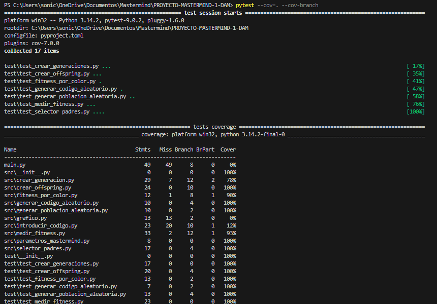
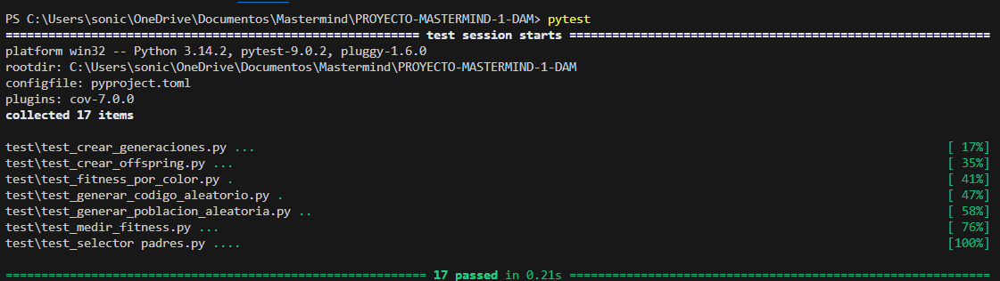

# ÍNDICE
<ul>
<li><a href='#introduccion'>Introducción</a></li>
<li><a href='#manual'>Manual</a></li>
<li><a href='#metodologia'>Metodología</a></li>
<li><a href='#descripcion'>Descripción técnica</a></li>
<li><a href='#diseño'>Diseño</a></li>
<li><a href='#implementacion'>Implementación</a></li>
<li><a href='pruebas'>Pruebas</a></li>
<li><a href='#tiempo'>Estudio de tiempo invertido</a></li>
<li><a href='#ia'>Uso de la IA</a></li>
<li><a href='#conclusion'>Conclusión</a></li>
</ul>

## 
Introducción

Juan Mateo Álvarez Álvarez  - <a href='https://github.com/Juan071825'>@Juan071825</a>  
Adrián González González    - <a href= 'https://github.com/Adriceka'>@Adriceka</a>

Este proyecto consiste en recrear en el lenguaje de programación python el juego de mesa Mastermind. Además de python también hemos utilizado otras herramientas y lenguajes como git, markdown, ruff.

## 
Manual

## 
Metodología

Para llevar a cabo este proyecto decidimos empezar por la lógica del proyecto.
Para saber que módulos de python con la lógica del programa teníamos que crear, seguimos la guía del algoritmo genético del libro Artificial Intelligence Algorithms de Rishal Hurbans.

La metodología empleada tiene su enfoque inspirado en <a href='https://es.wikipedia.org/wiki/Desarrollo_guiado_por_pruebas'>TDD</a> y consta de tres pasos:

<ol>
<li> Entre los dos integrantes del grupo hacemos una lista de requisitos que debe cumplir un módulo, de funcionalidades que debe de tener. Esto nos sirve para el siguiente paso. </li> 

<li> Uno se dedica a desarrollar el módulo utilizando, en un primer momento, las salidas por consola de guía, mientras que el otro creará los casos test.</li>  

<li> La última fase es la de comprobación, en la que se verá si un módulo pasa los casos test creados para él.</li> 
</ol>

Para la documentación simplemente seguimos los ejemplos dados en clase como guía de conteniudos que debía tener nuestro <a href='https://es.wikipedia.org/wiki/README'>README</a>.

## 
Descripción técnica

### Not list

## Historia de usuario

### 1. Introducción del código secreto  
**Como jugador, quiero** introducir un código secreto de 4 colores válidos,  
**para** que el algoritmo genético tenga un objetivo real que adivinar.

**Criterios de aceptación:**
- El usuario introduce 4 colores desde consola.  
- Los colores deben pertenecer al conjunto permitido.  
- El sistema convierte los colores en emojis.  
- El código permanece oculto durante toda la ejecución.

---

### 2. Verificación del código introducido  
**Como jugador, quiero** que el sistema valide mi código secreto,  
**para** asegurarme de que la partida empieza con un código correcto.

**Criterios de aceptación:**
- Se comprueba que hay exactamente 4 colores.  
- Se verifica que todos son válidos.  
- Si hay un error, se solicita corregirlo.

---

### 3. Inicio del algoritmo genético  
**Como usuario, quiero** que el algoritmo comience a generar intentos automáticamente,  
**para** ver cómo la máquina intenta adivinar mi código.

**Criterios de aceptación:**
- El algoritmo tiene un máximo de 14 generaciones.  
- Se muestra el progreso en consola.

---

### 4. Generación de cada intento  
**Como usuario, quiero** ver la mejor combinación generada en cada generación,  
**para** seguir la evolución del algoritmo.

**Criterios de aceptación:**
- Se muestra el número de intento.  
- Se imprime el cromosoma en emojis.  
- Se muestran los pines generados por el fitness.

---

### 5. Evaluación del intento (Fitness)  
**Como desarrollador, quiero** una función que compare cada individuo con el código secreto,  
**para** medir qué tan cerca está de la solución.

**Criterios de aceptación:**
- +4 puntos por acierto exacto (color y posición).  
- +1 punto por acierto parcial (color correcto, posición incorrecta).  
- Se generan pines rojos y blancos.  
- No se modifica el código secreto original.

---

### 6. Selección de padres  
**Como desarrollador, quiero** seleccionar individuos según su fitness,  
**para** favorecer la reproducción de los más prometedores.

**Criterios de aceptación:**
- Se selecciona un porcentaje definido por `PORCENTAJE_DEFUNCION`.  
- La selección usa pesos proporcionales al fitness.  
- Los individuos seleccionados se eliminan del pool para evitar duplicados.

---

### 7. Cruce de individuos  
**Como desarrollador, quiero** generar hijos combinando dos padres,  
**para** crear nuevas soluciones basadas en las mejores existentes.

**Criterios de aceptación:**
- El cruce puede ser por punto de corte o por selección aleatoria por gen.  
- El método se elige con probabilidad 70/30.  
- Se generan tantos hijos como indique `NUMERO_HIJOS`.

---

### 8. Mutación  
**Como desarrollador, quiero** aplicar mutaciones aleatorias a los hijos,  
**para** mantener diversidad genética y evitar estancamiento.

**Criterios de aceptación:**
- Cada gen puede mutar según `PROBABILIDAD_MUTACION`.  
- El nuevo alelo siempre es válido.  
- La mutación ocurre después del cruce.

---

### 9. Creación de la nueva generación  
**Como desarrollador, quiero** formar una nueva población combinando padres e hijos,  
**para** avanzar correctamente a la siguiente generación.

**Criterios de aceptación:**
- Se mantiene el mejor progenitor (elitismo).  
- Se añaden los padres seleccionados.  
- Se añaden todos los hijos generados.  
- Si faltan individuos, se rellena hasta `TAMAÑO_POBLACION`.

---

### 10. Finalización del juego  
**Como usuario, quiero** que el sistema termine cuando se resuelva el código o se alcance el límite,  
**para** conocer el resultado final de la partida.

**Criterios de aceptación:**
- El algoritmo se detiene si el fitness máximo es 16.  
- Se detiene si se alcanzan las 14 generaciones.  
- Se muestra el resultado final.  
- Se genera una gráfica con la evolución del uso de colores.

---

### Arquitectura de la aplicación

## 
Diseño

### Diagrama de componentes

## 
Implementación

### Tecnologías y herramientas utilizadas

<ul>
<li><a href='https://pypi.org/project/pytest/'>pytest</a>, es un framework de python para testear código.</li>
<li><a href='https://pypi.org/project/pytest-sugar/'>pytest-sugar</a>, es implementa dentro de pytest para hacerlo más visual y amigable.</li>
<li><a heref='https://coverage.readthedocs.io/en/7.13.0/'>Coverage</a>, es una herramienta que vine cuanto porcentaje de tu código se ejecuta al realizarse los casos test.</li>
<li><a href='https://es.wikipedia.org/wiki/Markdown'>Markdown</a>, es un lenguaje de marcado ligero.</li>
<li><a href='https://es.wikipedia.org/wiki/Git'>git</a>, es un software ideado para el control de versiones.</li>
<li><a href='https://docs.astral.sh/ruff/'>ruff</a>, es un <a href='https://keepcoding.io/blog/que-es-un-linter-en-programacion/'>linter</a> y formateador de código python</li>
</ul>

## 
Pruebas

### Coverage

### Pytest

## 
Análisis del tiempo invertido

La duración del proyecto ha sido de cuatro semanas aproximadamente. Los primeros días se utilizaron para comprender cómo llevar el algoritmo genético a desarrollo TDD, luego se repartieron los módulos entre ambos, y finalmente se trabajó en la implementación de todo el apartado gráfico.

### Reflexión sobre el tiempo invertido

## 
Uso de la IA

Se han utilizado ChatGPT y Copilot para:

- generar ejemplos iniciales

- explicar algoritmos genéticos

- resolver dudas técnicas

- generar una gráfica

## 
Conclusión

### Cosas a mejorar
Sería útil mejorar el orden y la cobertura de las pruebas, ya que en algunos casos se programó primero y se testeo después. También podrían añadirse mejoras visuales y una representación más clara de los individuos y parámetros del algoritmo para facilitar el análisis de la evolución.

### Dificultades

Durante el desarrollo del proyecto surgieron varias dificultades relacionadas tanto con la lógica del algoritmo genético como con la estructura del programa. Las más relevantes fueron:

- **Gestión de importaciones relativas**  
  Organizar los módulos dentro de la carpeta `src` y mantener importaciones limpias y coherentes requirió varios ajustes.

- **Coordinación entre módulos**  
  Asegurar que funciones como `medir_fitness`, `selector_padres`, `crear_offspring` y `crear_generacion` trabajaran correctamente juntas fue uno de los retos principales.

- **Control del estado de los individuos**  
  Evitar modificar accidentalmente el código secreto o los cromosomas durante el cálculo del fitness fue un punto crítico.

- **Visualización de datos con matplotlib**  
  Integrar la gráfica final y estructurar correctamente los datos de cada generación requirió ajustes en el flujo del programa.

Estas dificultades ayudaron a comprender mejor la estructura modular en Python, el funcionamiento de los algoritmos evolutivos y la importancia de mantener un flujo de datos limpio y controlado.

